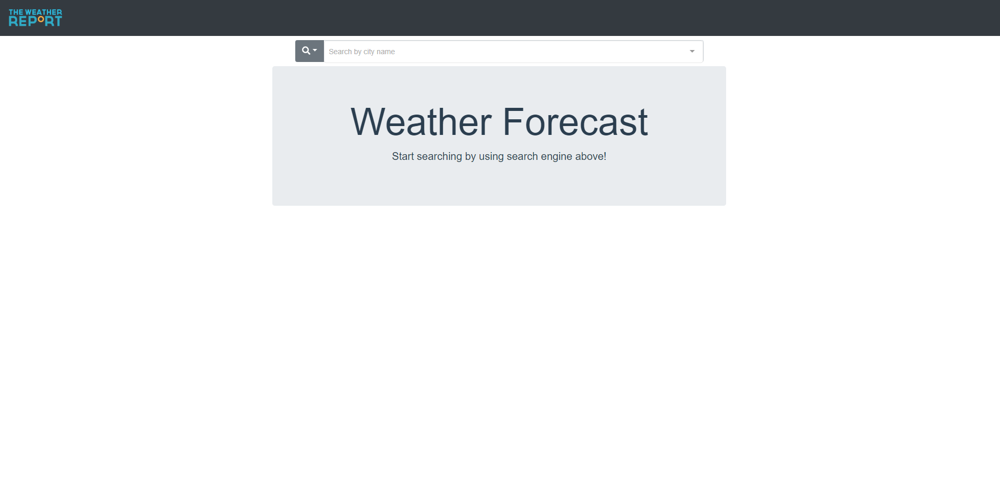
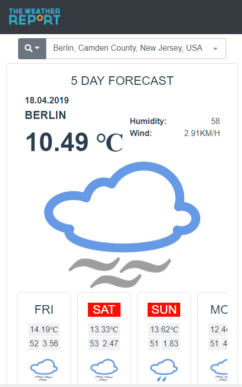

# Welcome to Weather Foreacast!

This app allowes you to search for a 5 day weather foreacast by given eaither city name or it's zip code address.

# Demo

# How to run?

## Docker

0. Have linux docker daemon up and running.
1. Make sure that API_URL in file '`WeatherForecast\WeatherForecast.Web\ClientApp\src`' is empty:
   export const API_HOST_URL = "";
1. Navigate to folder `WeatherForecast` which contains the file `docker-compose.yaml` and run commands: - `docker-compose build` - `docker-compose up`
1. In the browser go to: `https://localhost:8080`

## From source

0. Have ASP.Net Core 2.2 SDK and Node installed
1. Make sure that API_URL in file '`WeatherForecast\WeatherForecast.Web\ClientApp\src`' is pointing to correct api url:
   - export const API_HOST_URL = "https://localhost:5001";
1. In folder `ClientApp` run commands: - yarn - yarn serve
1. From WeatherForecast.sln run WeatherForecast.Web project as self hosted.
